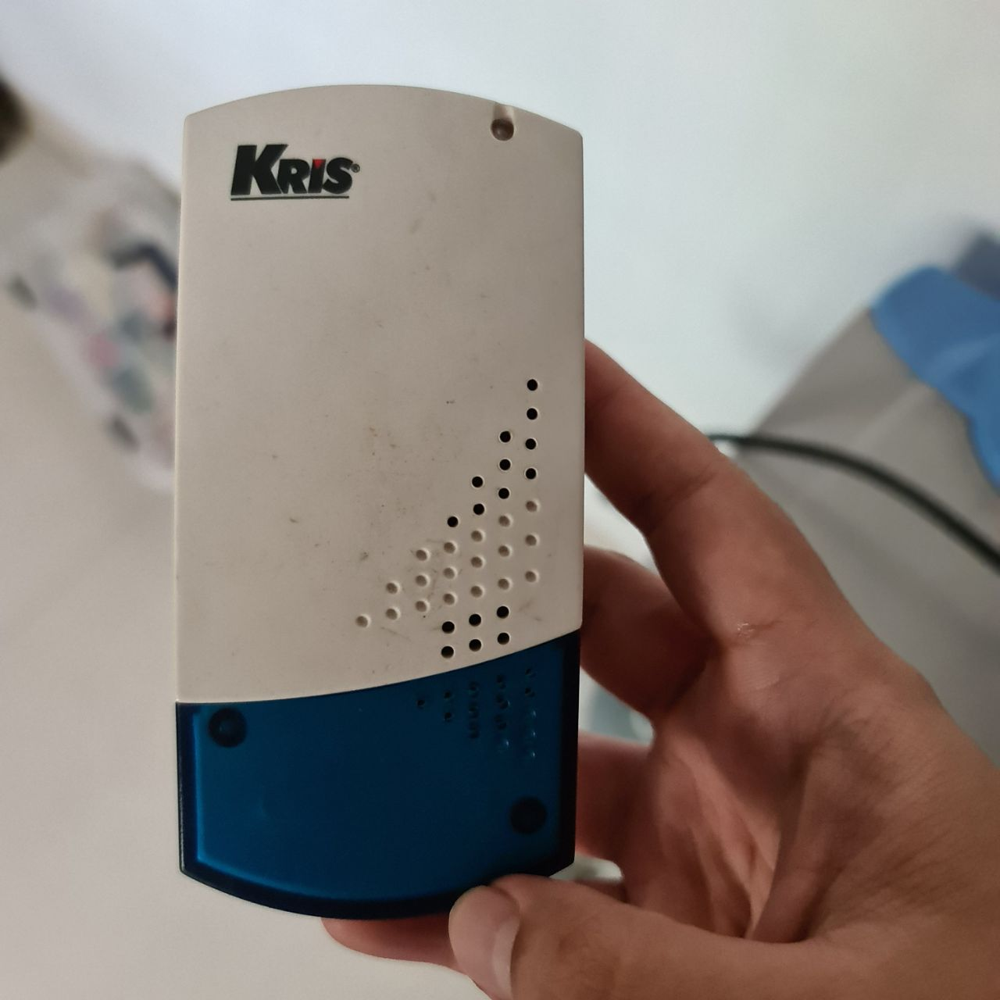
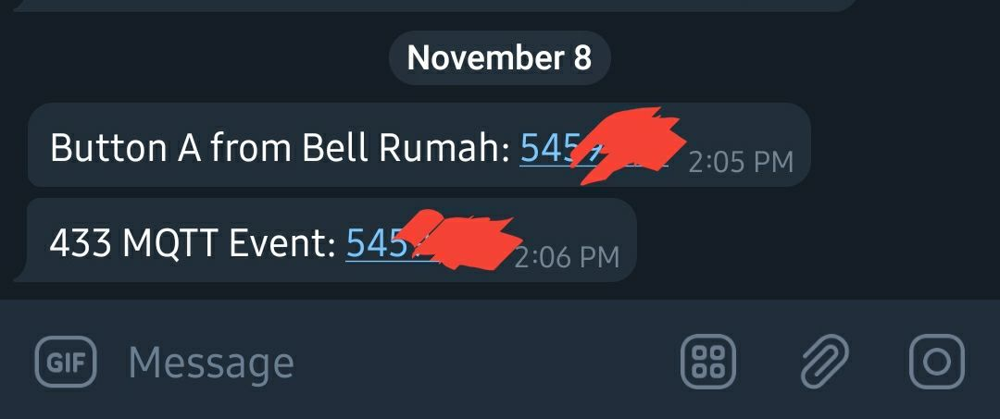
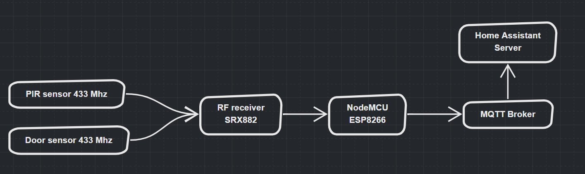
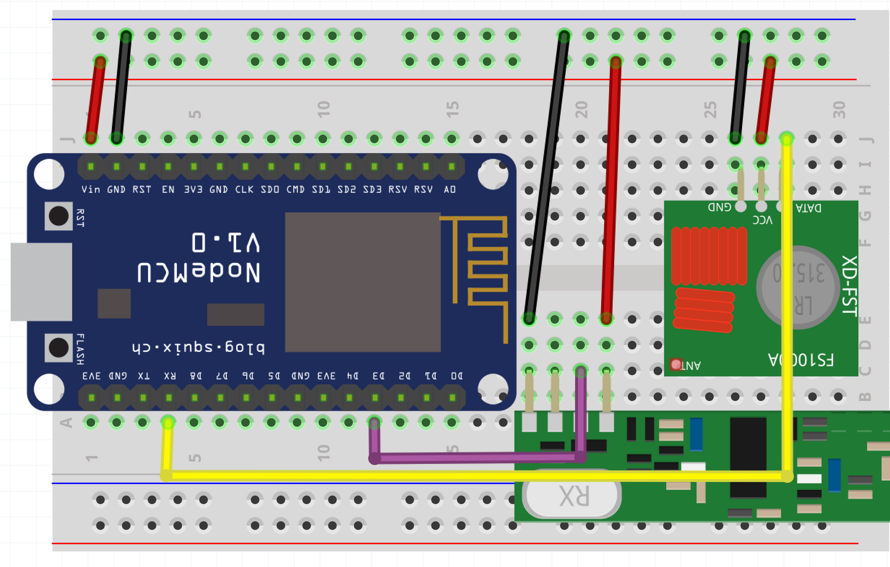
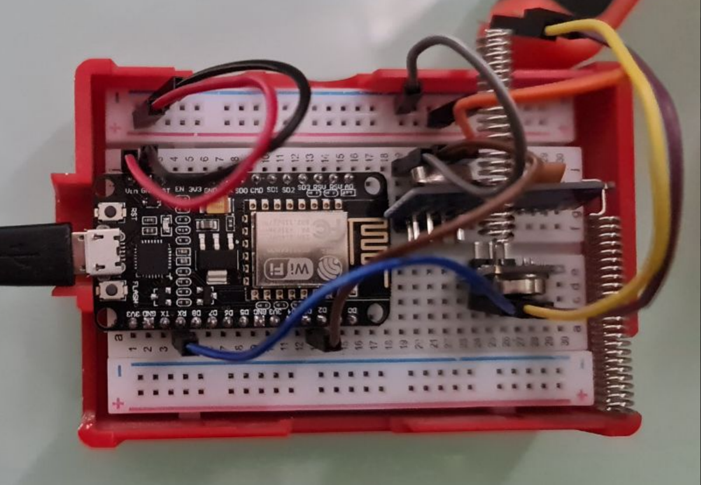
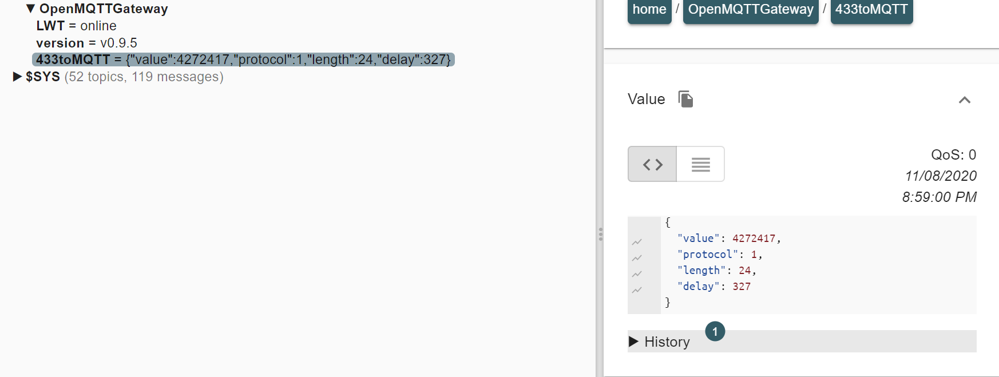
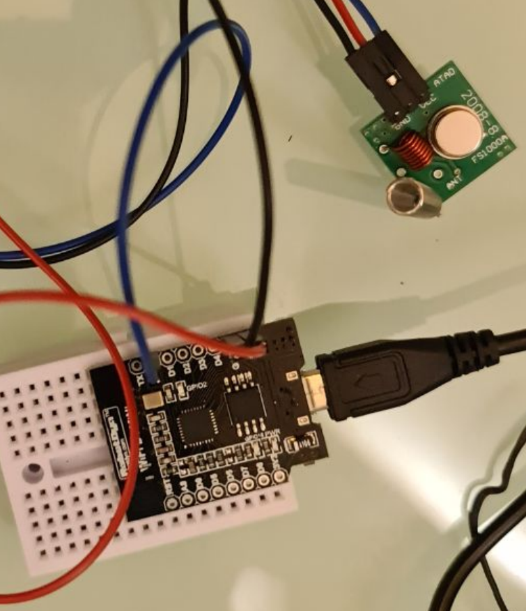

# Membuat DIY Bridge/Gateway RF (Radio Frequency) 433 yang terhubung ke Home Assistant

> Update 23 May 2021
> Dari informasi yang saya dapatkan, gelombang RF433 ini sudah tidak boleh lagi digunakan di Indonesia (?). Mohon koreksinya jika salah saya. Jika Anda tetap ingin membuat RF433 gateway ini, risiko ditanggung sendiri ya :)

Gelombang RF 433 Mhz adalah teknologi nirkabel yang cukup banyak dipakai di otomasi rumah cerdas, terutama perangkat-perangkat lama (contoh: perangkat sensor rumah dengan alarm GSM). Beberapa penyedia perangkat rumah cerdas sekarang juga masih menggunakan teknologi ini, seperti Sonoff (selain WIFI tentunya). RF 433 memiliki kelebihan jangkauan jarak yang lebih jauh, dan bisa menembus dinding. Namun kelemahannya, RF 433 ini kurang aman jika dibandingkan *wireless* teknologi lainnya.

Kenapa saya membuat RF Bridge yang terhubung ke Home Assistant?
Sederhananya, saya memiliki beberapa sensor lama yang tidak terpakai (sisa dari alarm GSM). Dan tanpa saya duga sebelumnya, ternyata bel rumah saya juga memakai frekuensi 433!



Setiap kali bell rumah dipencet, *event* tersebut bisa ditangkap oleh *home assistant* saya, dan bisa dimanfaatkan sebagai *trigger* untuk membuat otomasi. Misalnya, mengirimkan Telegram message, setiap bel dipencet



### Perangkat yang diperlukan

Name|Keterangan|URL Pembelian
-|-|-|
Microcontroller NodeMCU|Sebenarnya tidak harus NodeMCU, disarankan yang berbasis ESP9266 karena murah komponennya. Contoh lainnya: Wemos D1 Mini|https://www.tokopedia.com/rajacell/esp8266-module-nodemcu-lua-wifi-internet-of-things-development-board
SRX882 dan STX882|Module receiver dan transmitter RF 433|https://www.tokopedia.com/rajacell/100m-433mhz-rf-wireless-data-transceiver-module-stx882-srx882-arduino
FS1000A dan XY-MK-5V|Alternatif module receiver dan transmitter RF433.|https://www.tokopedia.com/awallaptop/modul-rx-tx-radio-pemancar-rf-kit-modul-on-off-wireless-diy-sepaket
Breadboard|Untuk mudahkan prototyping|https://www.tokopedia.com/arduinouno/project-board-projectboard-breadboard-bread-board-400-tie-point
Sonoff Remote 433Mhz|Jika Anda belum memiliki device 433 (atau tidak yakin), maka Anda bisa membeli remote ini|https://www.tokopedia.com/pandaking/sonoff-remote-control-rf-433mhz-remote-kontrol-433-mhz
Kabel-kabel| male pin dll|Sesuai kebutuhan saja|


### Cara membuat

Untuk membuat RF Gateway ini, saya menggunakan software open source, [OpenMQTTGateway](https://docs.openmqttgateway.com/) (OMG). Penggunaannya cukup mudah, dokumentasi sangat lengkap, dan komunitasnya juga aktif. OMG ini di-*flash* di NodeMCU, dan NodeMCU dihubungkan dengan sensor RF433 (SRX882 dan STX882). NodeMCU nanti juga akan terhubung dengan sinyal Wifi di rumah, sehingga bisa terhubung dengan MQTT broker yang sudah disiapkan sebelumnya (saya menggunakan [Mosquitto](https://mosquitto.org/) yang diinstall di Raspberry Pi)





Skema wiring dari dokumentasi official OMG [https://docs.openmqttgateway.com/setitup/rf.html](https://docs.openmqttgateway.com/setitup/rf.html)

Step-by-step nya sepertinya tidak perlu saya tulis ulang di sini, karena dokumentasi dari OpenMQTTGateway sudah sangat lengkap. Kira-kira langkahnya adalah sebagai berikut

1. Hubungkan NodeMCU (atau microcontroller ESP8266 lainnya) ke `SRX882` dan `STX882` mengikuti skema di [https://docs.openmqttgateway.com/setitup/rf.html#esp8266-hardware-setup](https://docs.openmqttgateway.com/setitup/rf.html#esp8266-hardware-setup). Di pengalaman saya, Pin Data di `SRX882`, mesti dihubungkan dengan GPIO `D2` (bukan `D3` sebagaimana default) di NodeMCU
2. Karena saya mesti melakukan modifikasi dari `D3` ke `D2`, maka saya perlu merubah source code OpenMQTTGateway, *compile* ulang dan baru diflash ke NodeMCU. Proses itu semua, dilakukan melalui ArduinoIDE. Silakan instruksi detail di [https://docs.openmqttgateway.com/upload/arduino-ide.html](https://docs.openmqttgateway.com/upload/arduino-ide.html)
3. Melengkapi step no.2 di atas, adapun file-file yang saya download adalah
    1. RF Library: [https://github.com/1technophile/OpenMQTTGateway/releases/download/v0.9.5/nodemcuv2-rf-libraries.zip](https://github.com/1technophile/OpenMQTTGateway/releases/download/v0.9.5/nodemcuv2-rf-libraries.zip)
    2. OpenMQTT Full Source Code: [https://github.com/1technophile/OpenMQTTGateway/releases/download/v0.9.5/OpenMQTTGateway_sources.zip](https://github.com/1technophile/OpenMQTTGateway/releases/download/v0.9.5/OpenMQTTGateway_sources.zip)
4. Ubah configurasi WIFI home network Anda, di file `User_config.h` , supaya nanti NodeMCU bisa langsung connect ke Wifi.
5. Selain itu, atur konfigurasi server MQTT broker anda, juga di file `User_config.h`
6. Hubungkan NodeMCU ke PC/laptop Anda melalui USB, lalu flash OpenMQTTGateway melalui ArduinoIDE
7. Berdoa, semoga berhasil!



Prototype RF433 Gateway menggunakan NodeMCU dan SRX882 dan STX882 yang saya buat

### Pengujian

Bagaimana cara melakukan pengujian apakah rangkaian berhasil? Jika Anda sudah membeli Remote 433 (seperti yang kasih contoh di daftar perangkat di atas), maka setiap tombol remote dipencet, maka akan ada MQTT event yang dipublish di MQTT broker kita. Untuk inspeksi event-event di MQTT broker, Anda bisa menggunakan software [MQTT Explorer](http://mqtt-explorer.com/)



## RF 433 Transmitter

Bagaimana dengan Transmitter RF 433? Ya, tentu saja bisa! Saya bisa membunyikan bel rumah saya dari home-assistant server saya. Cara membuat rangkaian nya, sama dengan apa yang ada di dokumen [https://docs.openmqttgateway.com/setitup/rf.html#esp8266-hardware-setup](https://docs.openmqttgateway.com/setitup/rf.html#esp8266-hardware-setup).

Dari pengalaman saya, saya belum berhasil membuat transmitter bekerja menggunakan komponen STX882 (kemungkinan harus diperbaiki kualitas wiringnya). Akhirnya, saya cari lagi komponen sejenis dan akhirnya ketemu yang bisa, yaitu `FS1000A`.



Prototype RF 433 Transmitter only, menggunakan FS1000A dan Wemos D1 Mini.

### Testing Pengiriman/Transmit RF 433

Cara mengirimkan kode RF433 juga sangat mudah. Anda cukup publish message MQTT ke topic `home/OpenMQTTGateway/commands/MQTTto433` (nama MQTT topic disesuaikan dengan punya anda). Misalnya, saya cukup mengirim MQTT message dengan payload seperti ini untuk membunyikan Bel rumah saya! (merk Kris)

```sql
{"value":5459967,"protocol":1,"length":24,"delay":209, "repeat": 30}
```

## Perangkat dan sensor lainnya yang kompatibel dengan RF433 Gateway ini

Sangat banyak! List lengkapnya bisa dilihat di bawah, atau di [https://docs.google.com/spreadsheets/d/1_5fQjAixzRtepkykmL-3uN3G5bLfQ0zMajM9OBZ1bx0/edit?usp=drive_web&ouid=104229190060678666526](https://docs.google.com/spreadsheets/d/1_5fQjAixzRtepkykmL-3uN3G5bLfQ0zMajM9OBZ1bx0/edit?usp=drive_web&ouid=104229190060678666526)

[RF devices - OpenMQTTGateway compatible](https://compatible.openmqttgateway.com/index.php/devices/rf-433mhz/)

Saya sendiri sudah mencoba 3 device merk DIGOO, yang saya beli dengan harga cukup murah dari bangood

### Perangkat RF433 yang sudah saya integrasikan dengan HA

Name|Description|URL
-|-|-|
Digoo DG-HOSA 433MHz Wireless Water Leakage|Sensor yang bisa mengirimkan kode RF433 jika mendeteksi adanya genangan air / banjir. Saya pakai ini, karena rumah saya pernah beberapa kali mengalami banjir masuk ke rumah|https://www.banggood.com/Digoo-DG-HOSA-433MHz-Wireless-Water-Leakage-Alarm-Water-Level-Detector-for-Home-Security-Guarding-p-1178109.html?p=SZ25159101562014119R&custlinkid=1187988
Digoo ROSA Siren|Sirene, yang bisa ditrigger dengan kode RF433 dari home automation server saya. Bisa dihubungkan dengan berbagai skenario|https://www.banggood.com/Digoo-DG-ROSA-433MHz-Wireless-Standalone-Alarm-Siren-Multi-function-Security-Systems-Host-p-1169577.html?p=SZ25159101562014119R&custlinkid=1187979
Digo DG-SD10 Door Bell|Bell rumah, yang tombol nya tidak perlu pakai baterai. Kelebihan bell ini, bisa ditrigger dengan berbagai kode RF433 yang berbeda, dan bisa menghasilkan bunyi yang berbeda juga! Namun sayangnya, ini tidak bekerja out of the box. Anda harus melakukan modifikasi minor terlebih dahulu di source code library RCSwitch (bisa dilihat di https://community.openmqttgateway.com/t/digoo-dg-sd10-doorbell/1137)|https://www.banggood.com/DIGOO-DG-SD10-Transmitter-Self-powered-Waterproof-Doorbell-EUUSUK-Plug-Unique-Sliding-Button-58-Me-p-1261378.html?rmmds=search&ID=47184&cur_warehouse=CN&p=SZ25159101562014119R&custlinkid=1206578
Sonoff DW1 Door Sensor||https://www.tokopedia.com/pandaking/sonoff-dw1-smart-door-sensor-rf-433mhz-alarm
Sonoff Remote 4 button||https://www.tokopedia.com/pandaking/sonoff-remote-control-rf-433mhz-remote-kontrol-433-mhz
Sonoff Remote 8 Button||