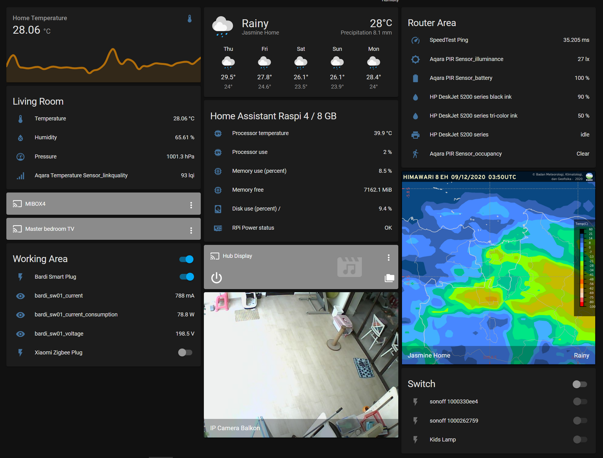
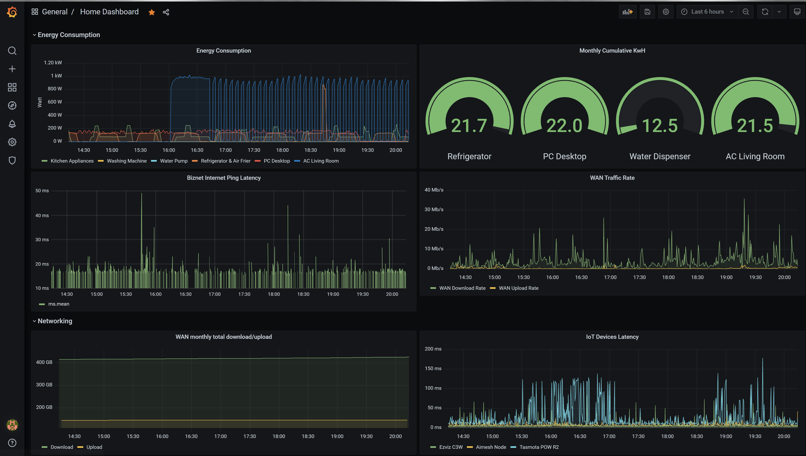
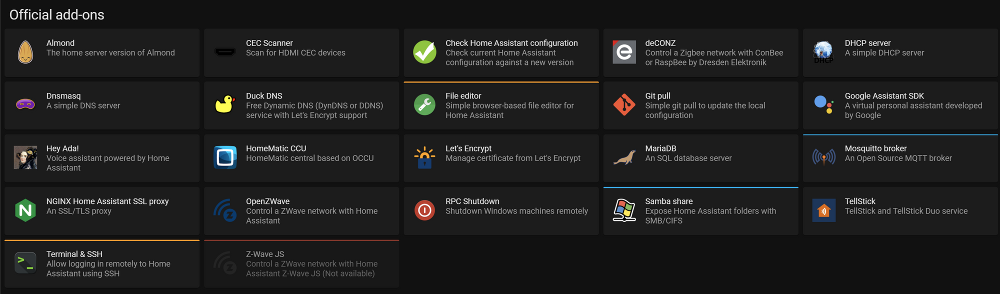
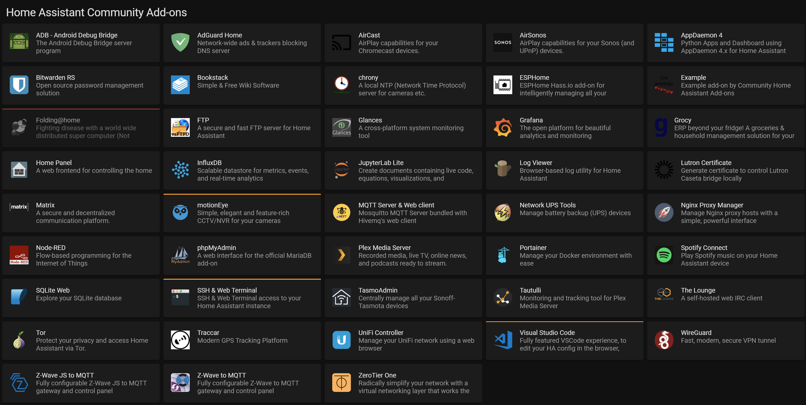
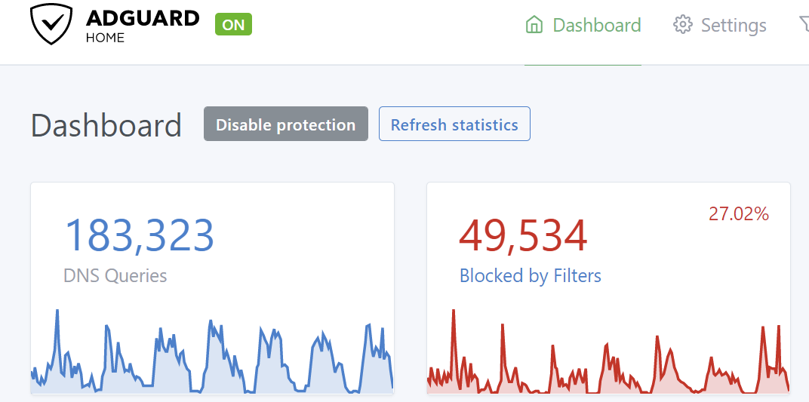
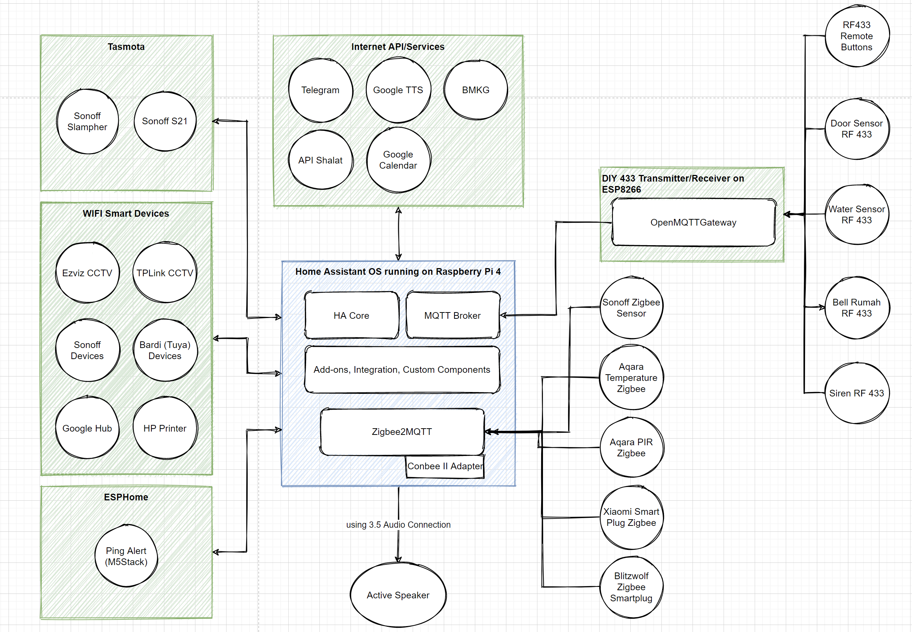

# Belajar Otomasi Rumah Cerdas Menggunakan Home Assistant

> Ditulis oleh Muhammad Rayhan (saya bisa dihubungi di Twitter [@md_ray](https://twitter.com/md_ray))
> Tulisan saya buat sebagai catatan pribadi saya dalam melakukan eksplorasi Home Assistant, untuk mengimplementasikan **rumah cerdas** di rumah saya. Harapannya tulisan ini juga bisa bermanfaat bagi orang lain yang memiliki ketertarikan yang sama. Bagi yang ingin berkontribusi, menyampaikan masukan atau kritikan silakan sampaikan di bagian *comment* atau hubungi saya langsung.

## Apa itu Home Assistant

*Home Assistant (*[https://www.home-assistant.io](https://www.home-assistant.io/)) adalah *software open source* otomasi rumah cerdas. Prinsip utama *Home Assistant* ini adalah mengutamakan koneksi lokal dan privasi pengguna. Artinya, pengguna bisa mengontrol penuh otomasi rumah mereka, dan tidak tergantung kepada jaringan Internet & layanan cloud

 
Dengan home assistant kita juga bisa mengumpulkan data-data / metrik menarik yang ada di rumah kita, dan juga memvisualisasikannya. Contohnya, saya menggunakan Home Assistant untuk mengukur konsumsi listrik di rumah, dan juga mengukur beberapa metrik terkait performansi jaringan di rumah saya

 

## Kenapa Home Assistant

- `Full-control`; Server *Home Assistant* ada di rumah kita. Data-data kita aman, dan tetap bisa jalan walaupun koneksi rumah ke Internet terputus
- `Software-structure` yang bagus; saya menyukai bagaimana struktur Software Home Assistant dirancang, seperti konsep *addons*, *integration*, *sensor*, *trigger*, *condition*, *action*, *template* dan *service*
- `Integration & Add-ons` : Home Assistant sangat ekstensible dan siap diintegrasikan dengan banyak komponen dan service. Pada saat tulisan ini dibuat, sudah tersedia lebih dari 1700 integrasi yang didukung oleh Home Assistant ([https://www.home-assistant.io/integrations/#all](https://www.home-assistant.io/integrations/#all)). Selain itu, Home Assistant juga mendukung *add-ons* yang memungkinkan kita menjalankan *software* tambahan di atas platform Home Assistant ini
- `Dashboard` (lovelace) yang bagus dan bisa dimodifikasi sesuai kebutuhan. Selain itu, aplikasi Web portal dan Mobile Application Home Assistant juga cukup mudah digunakan.
- Bisa di-install di `Raspberry Pi`. Saya pakai Raspberry Pi 4 (RAM 8 GB) sebagai server home assistant, dan so far stabil belum ada masalah always-on 24/7
- `Vendor-neutral`; Device/sensor yang sudah Anda punya, kemungkinan besar bisa diintegrasikan di Home Assistant. Tanpa harus tergantung lagi dengan aplikasi home automation, masing-masing vendor
- `Extensible`; Home Assistant merupakan produk *open source* yang dikelola oleh komunitas yang sangat aktif. Banyak fitur integrasi-integrasi baru yang dikembangkan dan diintegrasikan (lihat saja di [https://www.home-assistant.io/integrations/](https://www.home-assistant.io/integrations/))
- `Cost-effective`; Kita bisa kombinasikan device/sensor dari berbagai vendor, dengan harga yang efektif sesuai dengan fiturnya
- `Limitless` Home Automation Scenario! Karena Anda bisa *full-control*, integrasi yang banyak, perkembangan *software* yang aktif dibantu komunitas.
 

## Kenapa *tidak Home Assistant*

- Jika Anda tidak ingin ribet dan malas ngoprek, tidak disarankan menggunakan Home Assistant.
- Setup Home Assistant menurut saya juga membutuhkan sedikit pengalaman IT (misalnya, install OS, edit konfigurasi file, ssh, IP). Banyak ekosistem *home automation* lain yang jauh lebih mudah digunakan, seperti Bardi, Xiaomi dan Apple Homekit.
- Kekurangan lainnya, kita harus *maintain server* Home Assistant ini (misalnya, Raspberry Pi).
 

## Lebih dari sekadar Home Automation biasa

Tidak hanya menyediakan panel sentral untuk menghidupmatikan lampu (atau dengan jadwal otomatis), tidak hanya bisa mendeteksi *event* atau informasi dari sensor; jauh lebih dari itu. Home Assistant adalah platform lengkap *home automation* yang sangat bisa dikustomisasi sesuai kebutuhan. Kita bisa membuat [monitoring dashboard](Belajar%20Otomasi%20Rumah%20Cerdas%20Menggunakan%20Home%20Assi%20683d87a4b7744950abace6a79258cd93/Membuat%20Monitoring%20Server%20Home%20Assistant%2075f53946782245ca853723f1ea718ab2.md) misalnya, untuk memonitor banyak hal, seperti kondisi perangkat komputer kita, perangkat network seperti router, atau hal-hal umum seperti informasi cuaca, mata uang, dan saham (demo bisa diakses di [https://demo.home-assistant.io/#/lovelace/0](https://demo.home-assistant.io/#/lovelace/0)).

Home Assistant juga dilengkapi dengan kemampuan menjalankan *add-on. Add-on* dalam Home Assistant dijalankan dalam bentuk `docker` container; sebuah pilihan yang menarik karena dengan ini Home Assistant bisa menjalankan banyak sekali software-software yang sudah ada, menjadi satu dalam sebuah platform. 

 
Contohnya, saya menggunakan `AdGuard` sebuah open-source software yang berfungsi sebagai AdBlocker dan DNS Over HTTPS (DOH).

 

## FAQ (Frequently Asked Question)

*Q: Oke, bagus Home Assistant bisa bekerja offline. Tapi saya juga ingin dong, system saya tetap bisa diakses via Internet ketika saya tidak di dalam rumah*
A: Bisa! Ada dua cara: Cara pertama, Anda bisa setup port-forwarding dan ini juga membutuhkan domain name dan sertifikat SSL. Cara kedua lebih simple, Anda tinggal berlangganan 5 USD per bulan dengan layanan [Nobu Casa](https://www.nabucasa.com/)

*Q: Device apa saja umumnya yang dipakai untuk dijadikan server Home Automation*
A: Raspberry Pi (disarankan minimal Raspberry Pi 4 dengan RAM 2 GB) dan Intel NUC. 

*Q: Saya ingin coba setup server Home Assistant. Apa saja yang saya butuhkan*
A: Lengkapnya bisa diakses di [https://www.home-assistant.io/getting-started/](https://www.home-assistant.io/getting-started/). 
Anda akan membutuhkan Raspberry Pi 4 / Intel NUC, MicroSD, Card Reader, Wifi/Ethernet Connectivity.
 

## Arsitektur Home Assistant (HA) saya saat ini

 
## Apa yang sudah saya integrasikan dengan Home Assistant

Daftar perangkat yang sudah berhasil saya integrasikan dengan HA bisa dilihat di [sini](devices-integrated.md)
 

## Apa saja otomasi yang sudah saya buat dengan Home Assistant
Beberapa otomasi penting yang sudah saya buat antara lain
- Reminder/announcement jadwal kegiatan anak (e.g. sekolah, ekskul, ngaji) melalui beberapa speaker di rumah. Ini sangat membantu di situasi WFH/SFH yang mana kita sering lupa waktu. Jadwal kegiatan disimpan di Google Calendar
- Reminder/announcement ketika mesin cuci selesai. Bahkan saya buat reminder tambahan, ketika setelah durasi tertentu, pakaian juga belum dijemur
- Announcement di seluruh rumah ketika ada panggilan telefon masuk.
- Notifikasi di handphone ketika bell rumah dipencet
- Notifikasi ketika BMKG mengeluarkan peringatan dini hujan sedang/lebat
- Notifikasi ketika kamar mandi bawah airnya meluap (kondisi banjir). Alert dimainkan di speaker utama rumah
Untuk daftar lengkap otomasi yang sudah saya buat bisa diakses di [sini](daftar-otomasi.md)
 

## Zigbee & RF Gateway

Agar bisa menghubungkan Home Assistant dengan perangkat Zigbee dan RF433, saya membuat Gateway secara DIY. Detailnya bisa dilihat seperti link di bawah

[Membuat DIY Bridge/Gateway RF (Radio Frequency) 433 yang terhubung ke Home Assistant](DIY-RF-gateway.md)

[TODO] Membuat DIY Zigbee gateway
[TODO] Menghubungkan Conbee II dengan Home Assistant
 

## Kumpulan link lainnya

[Membuat Monitoring Server Home Assistant](monitoring-server-ha.md)
[Integrasi Tasker dengan Home Assistant](integrasi-tasker-HA.md)
[TODO-Integrasi phonecall/whastapp call ke Home Speaker](integrasi-call-speaker.md)
[TODO-Reminder pintu tertutup/terbuka terlalu lama](door-open-reminder.md)
[[WIP] Integrasi Home Assistant dengan Google Calendar](integrasi-google-calendar.md)
[TODO-Integrasi Home Assistant dengan Asus Router](undef.md)