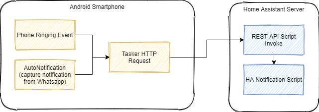
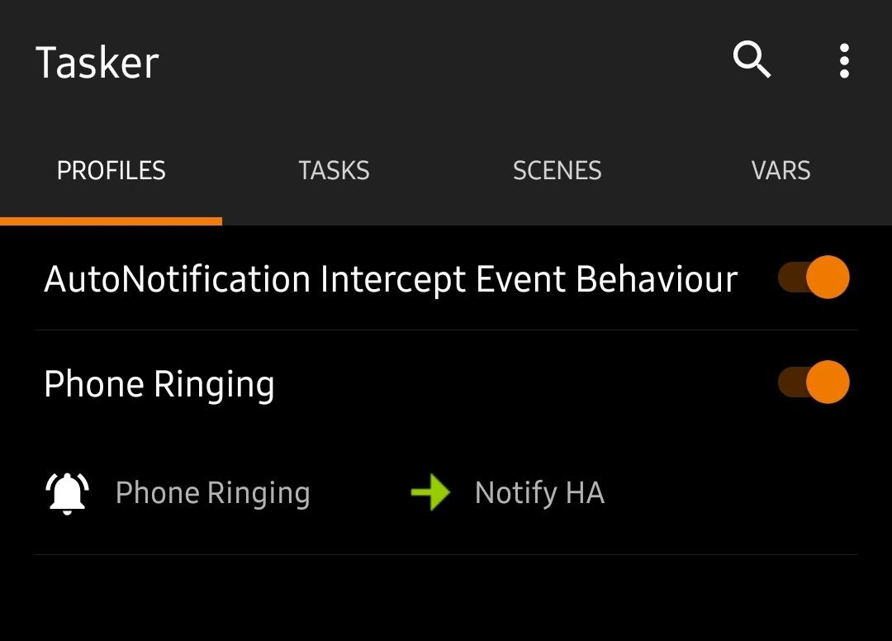

# Integrasi Tasker dengan Home Assistant

> Update: Untuk menghubungkan panggilan telepon dengan Home Assistant, ternyata ada cara yang lebih mudah! Yaitu dengan menggunakan Sensor yang ada di aplikasi mobile Home Assistant Companion. Untuk informasi lebih lanjut, bisa dilihat di https://companion.home-assistant.io/docs/core/sensors/
> Saya akan buat tulisan terpisah mengenai penggunaannya nanti.

Saya diberikan tantangan oleh istri: Untuk mendukung program detox smartphone, dia ingin smart speaker Home Assistant saya membunyikan alarm notifikasi ketika ada panggilan telepon masuk (telepon biasa maupun whatsapp), dan juga ketika ada pesan dari driver gojek misalnya. Jika bisa seperti ini, dia tidak perlu dekat terus dengan Smartphone terus selama beraktivitas di rumah.

Bagaimana caranya membuat otomasi ini dengan HA (Home Assistant)? Cukup mudah, karena Home Assistant sudah memiliki fitur *built-in* untuk menjalankan script melalui invokasi REST API. Script-nya bisa apa saja? Tergantung apa yang sudah setup di setup HA Anda. Misalnya

- Memainkan suara bell/alarm notifikasi
- Memberikan pesan suara melalui text-to-speech
- Mengedipkan lampu, merubah warna  lampu, dll

Bagaimana cara menangkap *event* panggilan telepon masuk di smartphone? Sehingga event ini bisa diteruskan ke Home Assistant? Untungnya di Android juga sudah tersedia aplikasi `Tasker`

Melalui aplikasi `Tasker` ini berikut plugins, event panggilan telepon masuk bisa ditangkap, dan diteruskan sebagai REST API call ke Home Assistant



## Membuat long-lived Token dan Menyiapkan Script Notifikasi di HA

Ketika memanggil REST API dari Home Assistant, kita akan membutuhkan sebuah token yang dipakai untuk melakukan *authentication.* Token ini perlu kita *generate* terlebih dahulu melalui UI Home Assistant —> User Profile (klik nama user Anda, biasanya di menu kiri paling bawah) —> Long-lived Access Token. Setelah dibuat, copy-paste token tersebut ke text editor Anda. Token tersebut akan berupa sebuah string yang cukup panjang. Contohnya:

```
eyJ0eXAiOiJKV1QiLCJhbGciOiJIUzI1NiJ9.XXXXXXXXXXXXXXXXXXXXXzYzOTIwZWNiZTNjNDgzNTdmYyIsImlhdCI6MTYxMzExNDI1NCwiZXhwIjoxOTI4NDc0MjU0fQ.XXXXXXXXXXXXXXXXXXXX
```

Kemudian, kita perlu mempersiapkan *script* yang akan dijalankan sebagai notifikasi, misalnya untuk memainkan suara notifikasi di speaker.

Contoh punya saya:

```yaml
alias: Play Whatsapp Alarm
sequence:
  - service: media_player.play_media
    data:
      media_content_id: 'http://192.168.XX.XX:9000/antique-bell.mp3'
      media_content_type: audio/mp3
    entity_id: media_player.mopidy
mode: single
```

Catat Unique ID dari script ini. Misalnya di saya, ID nya adalah `script.1613114353397`

Kemudian untuk memastikan token dan scriptnya bisa dipanggil dari luar HA, kita coba panggil REST API melalui curl/postman (192.168.XX.XX adalah IP dari Home Assistant Anda).

```bash
POST /api/services/script/turn_on HTTP/1.1
Host: 192.168.XX.XX:8123
Authorization: Bearer [long-lived-token-anda]

{"entity_id": "[unique-id-HA-script]"}
```

## Mempersiapkan Konfigurasi Tasker

### Menggunakan Task HTTP Request untuk memanggil REST API

Pertama, kita perlu menyiapkan sebuah Task untuk memanggil REST API yang sudah kita siapkan tadi, yaitu sebuah HTTP Request

Method —> POST
URL —> http://192.168.XX.XX:8123/api/services/script/turn_on
Body —> {"entity_id": "[unique-id-HA-script]"}

Header —> Authorization: Bearer [long-lived-token-anda]

### Menyiapkan profile event telepon masuk



**Event Phone Ringing** —> Event Telepon Masuk Biasa

**Event Add-on** `AutoNotification` —> Event Whatsapp Call.

Untuk WhatsApp call, kita membutuhkan add-on dari Tasker, bernama `AutoNotification` yang memiliki kemampuan untuk menangkap dan membaca informasi dari notifikasi Android dari aplikasi apapun, dan bisa dijadikan trigger di Tasker

Selamat mencoba!