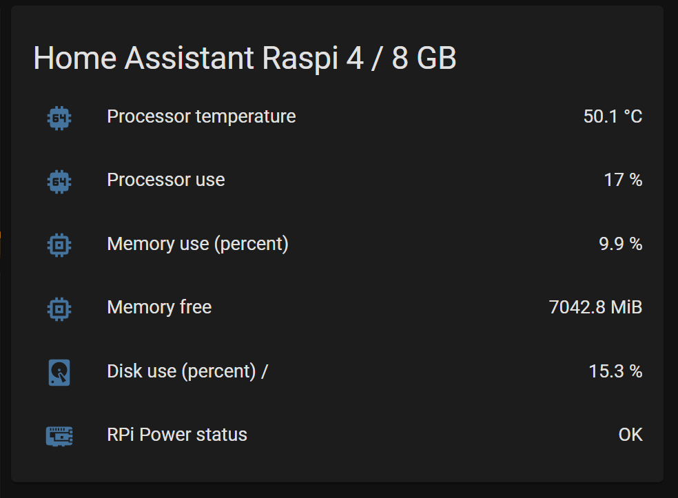
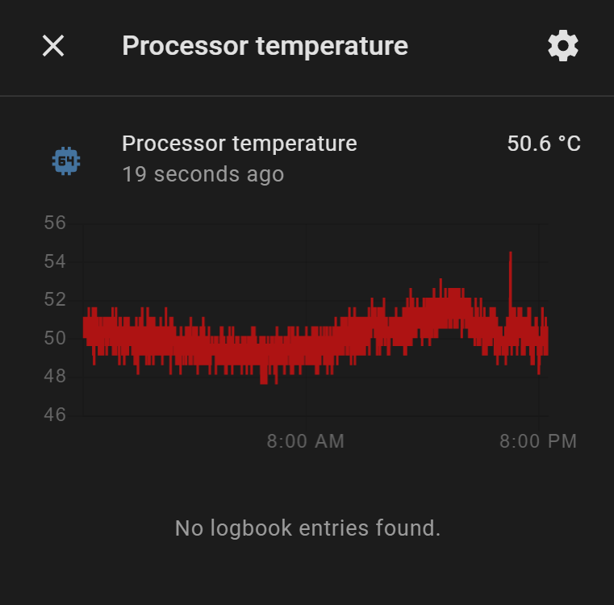

# Membuat Monitoring Server Home Assistant

Kita sudah tahu bahwa Home Assistant (HA) membutuhkan server untuk *running service-*nya. *Server* ini akan running 24/7, dan akan menjadi sentral dari seluruh *home automation* kita. Jadi, cukup penting kita secara reguler memonitor *kesehatan* dari *server* ini, untuk memastikan kondisinya prima dan awet dipakai terus menerus.

Saya sendiri menggunakan Raspberry Pi 4 / 8 GB sebagai *host server* HA saya (Fyi, agak overkill. Saran saya, cukup Raspberry Pi 4 dengan 4 GB RAM)

Adapun beberapa sensor/*metric* yang saya monitor dari *server* saya ini bisa dilihat di bawah



*Temperature* cukup penting untuk diperhatikan supaya Rasperry Pi bisa awet. Sebelumnya, saya tidak fan, suhu rata2 bisa mencapai 60-70 C. Sebenarnya masih cukup aman, tapi sangat ingin buat lebih rendah lagi, sehingga saya tambahkan fan sehingga rata2 suhu bisa dikisaran 40-50 C.



Jika Anda menggunakan Raspberry Pi juga seperti saya, perlu dipastikan juga supaya Raspi kita jangan *undervoltage.* Pastikan menggunakan adaptop / power supply yang berkualitas (murni 5V dan 3A). Saya juga tambahkan sensor monitoring `RPi Power Status` untuk memastikan Raspi saya mendapat *supply* daya yang cukup atau tidak.

## Cara menambahkan sensor ke HA

### `SystemMonitor`

Sudah disediakan built-in integration `SystemMonitor` yang bisa digunakan untuk memonitor suhu/*temperature*, CPU usage, Free Memory, Disk Space, dll. Cara menambahkan sensor ini cukup mudah, yaitu dengan menambahkan sensor dengan platform `SystemMonitor` seperti di bawah ini

```yaml
sensor:
- platform: systemmonitor
    resources:
      - type: disk_use_percent
        arg: /
      - type: memory_free
      - type: memory_use_percent
      - type: load_1m
      - type: load_5m
      - type: processor_use
      - type: processor_temperature
```

Informasi lebih lanjut dari sensor `SystemMonitor` ini bisa diakses di [https://www.home-assistant.io/integrations/systemmonitor/](https://www.home-assistant.io/integrations/systemmonitor/)

### `RPIPower`

Untuk memonitor pasokan daya ke Raspberry Pi, saya menggunakan *custom component `rpi_power`* yang bisa diunduh dari [https://github.com/custom-components/sensor.rpi_power](https://github.com/custom-components/sensor.rpi_power). Harap ikuti petunjuk instalasi yang sudah disediakan.